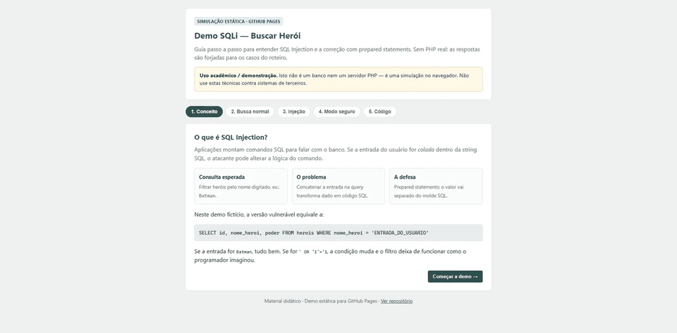

# Laboratório acadêmico de SQL Injection (PHP + SQLite)

Material didático para entender **o que é SQL Injection (SQLi)**, **por que acontece**, **qual o impacto** e **como mitigar** com prepared statements — usando um catálogo fictício de heróis.

### Demo estática (GitHub Pages)

Quer só ver o fluxo sem instalar PHP? Abra a [demo no GitHub Pages](https://guilhermeroesler.github.io/Demo-SQLi/) ou a pasta [`docs/`](docs/) — guia passo a passo no navegador, com respostas **simuladas** (sem backend).

[](https://guilhermeroesler.github.io/Demo-SQLi/)

Para publicar: no GitHub, **Settings → Pages → Deploy from a branch**, escolha a branch principal e a pasta `/docs`.

> **Aviso ético (obrigatório)**
>
> - Uso **somente acadêmico / laboratório autorizado**.
> - O lab PHP deve rodar **apenas em `localhost`**. Não publique `buscar.php` / `setup.php` como backend público.
> - A pasta `docs/` é uma **simulação estática** segura para Pages — não executa SQL de verdade.
> - Os payloads do roteiro são para este ambiente controlado. **Não** use contra sistemas de terceiros.
> - Este repositório contém código **intencionalmente vulnerável** (`buscar.php`).

---

## O que é SQLi? (o “porquê”)

Aplicações montam comandos SQL para falar com o banco. Se a **entrada do usuário** (URL, formulário, cookie…) for **colada dentro** da string SQL, o atacante pode alterar a lógica do comando: ler tabelas que não deveria, contornar autenticação, às vezes alterar ou apagar dados.

Neste lab, a versão vulnerável faz algo equivalente a:

```sql
SELECT id, nome_heroi, poder FROM herois WHERE nome_heroi = 'ENTRADA_DO_USUARIO'
```

Se `ENTRADA_DO_USUARIO` for `Batman`, tudo bem. Se for `' OR '1'='1`, a condição muda e a consulta deixa de filtrar como o programador imaginou.

### Impacto típico

| Impacto | Exemplo neste lab |
|--------|-------------------|
| Bypass de filtro | Ver todos os heróis sem saber o nome |
| Vazamento de dados | Expor a tabela `usuarios` via `UNION` |
| Em apps reais | Login bypass, roubo de PII, alteração de dados, em casos graves RCE via DB |

### Mitigação principal (o que este lab ensina)

**Prepared statements / consultas parametrizadas**: o SQL vai com *placeholders* (`?`); os valores seguem **separados**. O banco trata a entrada como **dado**, não como código SQL.

Prepared statements **não resolvem sozinhos** tudo:

- Ainda é preciso cuidado com identificadores dinâmicos (nome de tabela/coluna), se existirem.
- Defesa em profundidade: menor privilégio no DB, validação de entrada, WAF (camada extra, não substituto), não expor erros SQL em produção.
- Outras falhas (XSS, IDOR, etc.) continuam possíveis — este lab foca em SQLi.

### Escopo deste laboratório

O roteiro prático cobre um caminho clássico de **injeção in-band / UNION-based** (erro visível + resultados na mesma resposta). Em disciplinas mais avançadas costumam aparecer também:

- **Error-based** — extrair dados via mensagens de erro  
- **Boolean / time-based blind** — inferir dados sem ver o resultado direto  
- **Second-order** — payload armazenado e disparado depois  

Aqui o objetivo é a **intuição sólida** do problema e da defesa; o README do professor sugere extensões.

---

## Arquivos

| Arquivo | Função |
|---------|--------|
| `docs/index.html` | Demo estática (GitHub Pages) — roteiro simulado |
| `docs/og.png` | Imagem Open Graph / Twitter Card (1200×630) |
| `docs/favicon.svg` | Ícone da demo (também em PNG 32 / apple-touch) |
| `docs/screenshots/` | Prévia WebP responsiva + PNG de fallback |
| `setup.php` | Cria/recria `lab.db` e dados fictícios |
| `conexao.php` | Conexão PDO → SQLite |
| `index.html` | Interface com **dois modos** (vulnerável / seguro) |
| `buscar.php` | Busca **vulnerável** (concatenação) |
| `buscar_seguro.php` | Busca **segura** (prepared statement) |
| `readme.md` | Este guia |

---

## Roteiro do aluno

### 1. Configurar o ambiente

1. Instale o PHP (com extensão PDO SQLite). No Windows, o zip de [php.net/downloads](https://www.php.net/downloads) basta.
2. No terminal, na pasta deste projeto:

```bash
php -S localhost:8000
```

3. Abra `http://localhost:8000/setup.php` uma vez (cria `lab.db`).
4. Abra `http://localhost:8000/index.html`.

### 2. Teste funcional (os dois modos)

1. Em **Versão vulnerável**, busque `Batman` → deve aparecer o herói.
2. Alterne para **Versão segura**, busque `Batman` de novo → mesmo resultado legítimo.
3. Observação: o comportamento “normal” é igual; a diferença aparece com payloads.

### 3. Explorar a vulnerabilidade (`buscar.php`)

Use o modo **vulnerável**. A página mostra a SQL montada — use isso para raciocinar.

**Bypass do filtro**

- Entrada: `' OR '1'='1`
- Esperado: vários (ou todos) heróis, porque a condição fica sempre verdadeira.

**Descobrir número de colunas** (útil antes de UNION)

- `' ORDER BY 3 --` → tende a funcionar (há 3 colunas no `SELECT`).
- `' ORDER BY 4 --` → erro (coluna 4 não existe).

**UNION (vazar outra tabela)**

- `x' UNION SELECT id, username, password_hash FROM usuarios --`
- Esperado: linhas da tabela `usuarios` (dados **fictícios** do lab) aparecem como se fossem heróis.

### 4. Conferir a correção (`buscar_seguro.php`)

1. Volte ao `index.html` e escolha **Versão segura**.
2. Repita o payload do UNION (ou o `' OR '1'='1`).
3. Esperado: **nenhum herói** (ou só match literal inexistente). A string inteira foi buscada como *nome*, não como SQL.

**Por quê?** Em `buscar_seguro.php` o valor vai no `execute([...])`, separado do molde SQL.

### 5. Checkpoint (autocontrole)

- [ ] Sei explicar SQLi em uma frase.  
- [ ] Sei apontar a linha vulnerável em `buscar.php`.  
- [ ] Sei dizer o que muda em `buscar_seguro.php`.  
- [ ] Entendi que este lab **não** deve sair do localhost.

---

## Roteiro do professor

### Objetivos de aprendizagem

1. Identificar concatenação insegura de entrada em SQL.  
2. Demonstrar impacto (bypass + vazamento via UNION) em ambiente controlado.  
3. Aplicar e justificar prepared statements.  
4. Discutir limites da mitigação e ética de uso.

### Sugestão de aula (~40–50 min)

| Tempo | Atividade |
|------|-----------|
| 5 min | Conceito + disclaimer ético |
| 5 min | Setup coletivo (`php -S` + `setup.php`) |
| 10 min | Alunos no modo vulnerável (passos 2–3) |
| 10 min | Comparar SQL montada vs modo seguro |
| 10 min | Abrir os dois PHP lado a lado no editor |
| 5–10 min | Discussão: produção, privilégios DB, blind SQLi |

### Perguntas para debate

- Por que “escapar aspas” à mão é frágil como defesa principal?  
- Prepared statement impede `ORDER BY` / nomes de coluna dinâmicos vindos do usuário?  
- O que muda se o DB do app tiver só permissão `SELECT` em `herois`?  
- Qual a diferença ética entre lab local e testar o site da faculdade sem autorização?

### Extensões (trabalho / próxima aula)

- Pedir um slide: “antes / depois” do código.  
- Desafio: adicionar um endpoint seguro de listagem com filtro por `id` (inteiro tipado).  
- Leitura: OWASP — SQL Injection / Query Parameterization Cheat Sheet.  
- Avançado (conceitual): resumir blind SQLi sem implementar exploits extras neste repo.

### Avaliação rápida

- Quiz: dado um trecho PHP, marcar vulnerável ou seguro.  
- Entrega: print do SQL montado no bypass + print do modo seguro falhando no mesmo payload.

---

## Requisitos

- PHP 8+ recomendado (PDO + `pdo_sqlite`)
- Navegador
- Sem MySQL/XAMPP obrigatório

---

## Licença de uso do material

Conteúdo para ensino. Redistribua citando o repositório. Lembre os alunos do aviso ético no topo.
